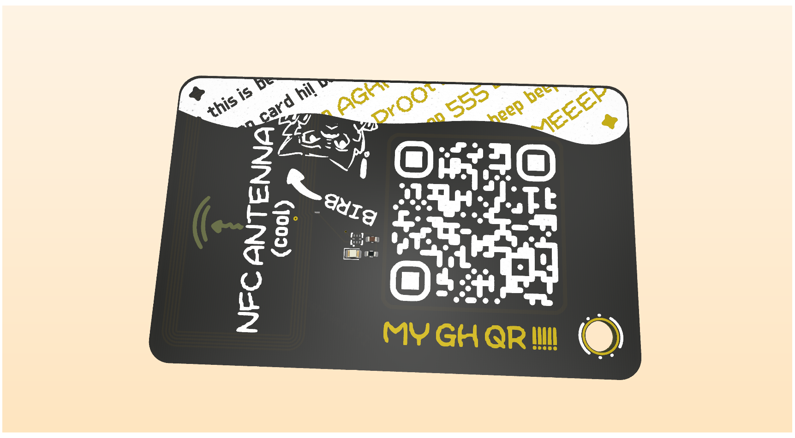

**Total time spent: 6h 37min**

# August 1st

hello. I wanted to make a hacker card for my self and... uhh I practically gotten my self into this situation where highway is ending and I didn't make my hacker card. sooo, I decided to make it after doing some beautiful procrastination.

I'll be using this [tutorial](https://jams.hackclub.com/jam/hacker-card) as a big guide for making this card.

Uhm... as you might see this was made in a rush. That means pretty bad descriptions and all of that. Sorry about that haha.

This is how the card started in figma:

Quite simple, right?

Then I added more things to the back of the card and left forgotten the things in the front with simple stuff.

> The first image is the back and the second one is the front.

In the end I stopped making screenshots of everything I made and from that point I practically added things directly to the pcb without passing it through figma. That means the only thing I can show is the finished pcb itself. Sorry!!

These are the final resulta after skipping all the correct steps:

> The first image is the front and the second one is the back.

See how I stated that in the start I practically forgot about the front of the card? Yeah... I really did. I was so focused on the back of the card that I didn't even think about the front. It just a barren land with my name and that's it lol.

In the end I used up 6 whole hours to do all of this. I don't work great when am with a deadline imposed primarily by my own self thanks to my stupidity lol.

**Total time spent: 6h**

BUT Leaving that aside, I'm still proud of myself for making this card. It looks great (in my eyes at least) even though I didn't even journal it correctly haha.

---

Thanks to one of the reviewers I've fixed the copper that was practically next to the NFC antenna. If I hadn't done this the antenna won't work properly or even have a really really bad range. Thanks Logan!

Btw, it was a really easy fix. Just removed a lil' bit of the copper and that's it or I think so :3. Here's how it looks now:

I also updated the readme images to reflect the changes :).

**Total time spent: 22min**

---

Seems like I left in the center lines inside the copper layer I've used to position stuff around the card. Just fixed that too.

You could see it in the last screenshots, but here's one with amplification:

> You can see the center lines in the front part of the pcb.

This doesn't really need a whole new screenshot so am just going to update the README with the new images (even though there's minimal changes).

**Total time spent: 10min**

---

woops. The BIRB text had its REF visible! I fixed that by hiding it (pressing SUPR). I also checked the other images in the silkscreen for the same thing to be fixed lol.

**Total time spent: 5min**
