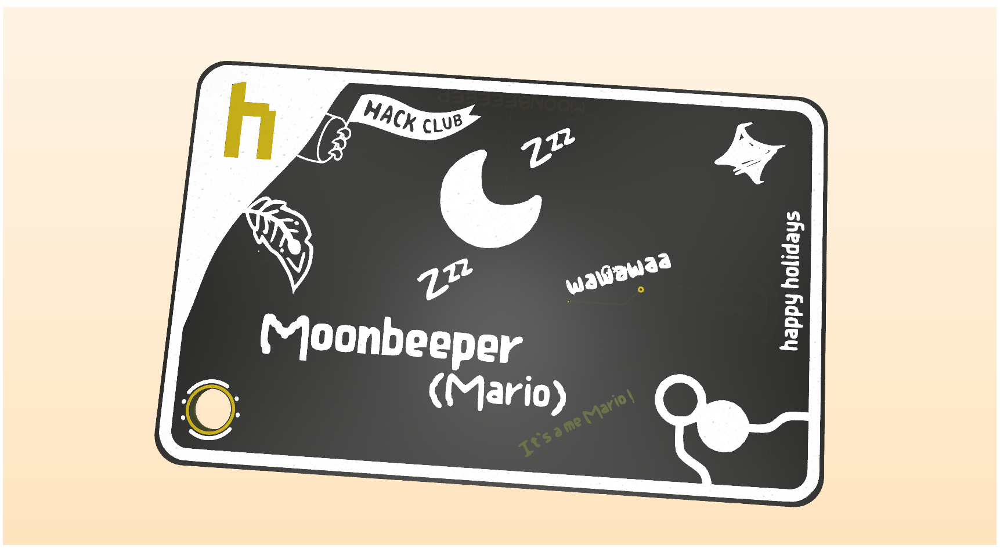
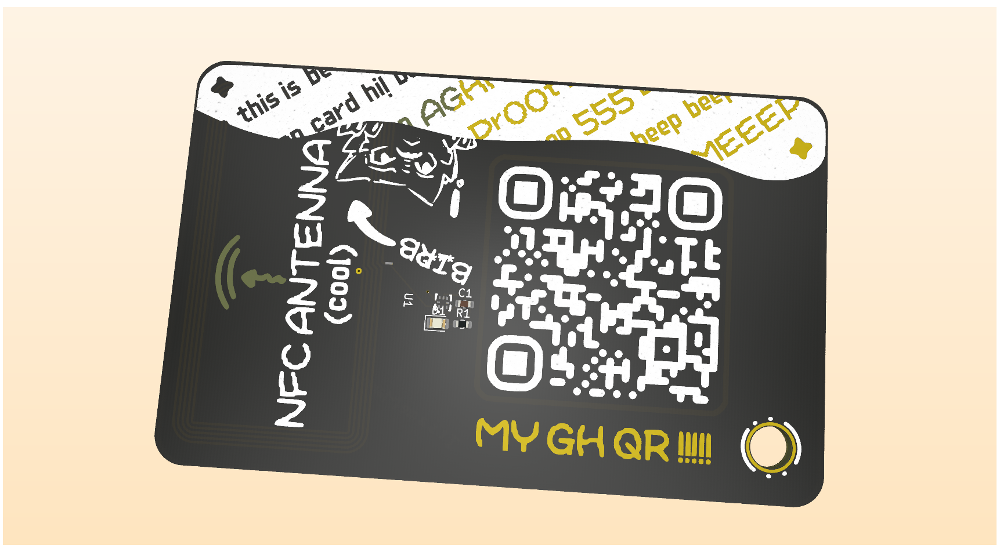

# Moon's Hacker Card

Its my own hacker pcb card! It has the typical stuff a NFC chip and art made by me and birb.

sadly it was done in speedrun mode lol. I will try to make the readme better in the future!!!

For future info, I've used the hack club's [hack card](https://jams.hackclub.com/jam/hacker-card) guide for making this card!

## Images

> The first image is the front and the second one is the back.

## BOM

> Shipping costs might be higher!

> NOTE: It's a copy of the bom.csv file from the production folder.

| Designator           | Footprint                                      | Quantity | Value               | LCSC Part # | Price   |
|----------------------|------------------------------------------------|----------|----------------------|-------------|---------|
| 220nF Capacitor      | 0603                                           | 1        | 220nF               |             |         |
| LED Yellow-Green     | 0805                                           | 1        | LED                 |             |         |
| NFC Antenna - Wire   | 25X48MM_NFC                                    | 1        | 25X48MM_NFC_ANTENNA |             |         |
| 47 Resistor          | 0603                                           | 1        | 47                  |             |         |
| NFC Chip             | XQFN-8_L1.6-W1.6-P0.50-BL_NT3H2111W0FHKH       | 1        | NT3H2111W0FHKH      | C710403     |         |
| **PCBs**             |                                                | 5        |                      |             | **$2** |
| **PCBA Total**       |                                                | 2        |                      |             | **$15.12** |
| **~Shipping**        |                                                |          |                      |             | **$15.00** |
| **Total**            |                                                |          |                      |             | **$32.12** |
